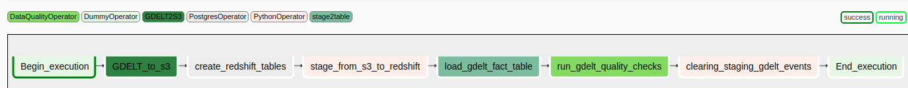
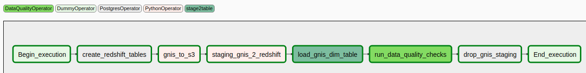
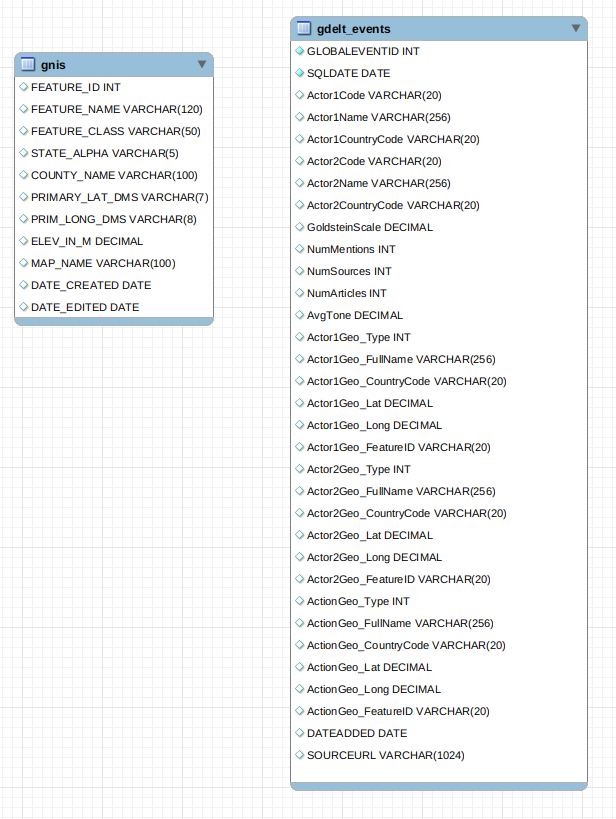
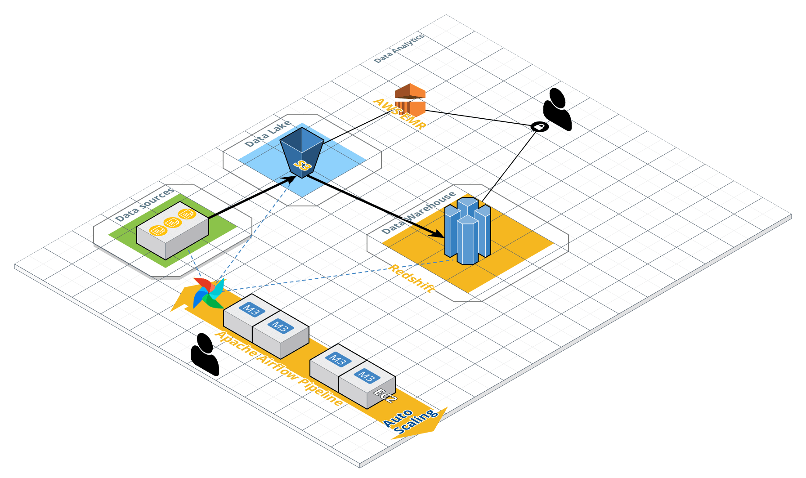

# DEND-Capstone
## Udacity Data Engineering Capstone Project.

The **main goal** of the project is to demonstrate several, but by no means all, skills associated with data engineering tasks on selected datasets. 

This project uses two datasets GDELT and GNIS described in `Documentation` folder. The first (GDELT) is a data stream generated each day at 6 am EST time, describing events happening around the world. The second dataset (GNIS) is a static (not dynamically updated) dataset providing geographic details for features occuring in the first dataset.

For selected data sources I am first performing basic Exploratory Data Analysis on chunks of full datasets, focusing rather on data consistency: missing values and identifying potential duplicated entries `Notebooks/EDA/`. Subsequently I am developing scalable data ingestion architecture using Amazon Web Services. The architecture is provided as code (`IaC`: **Infrastructure as Code**) through a set of helper functions, and a notebook interactive enrionment to demonstrate the creation and termination of parts of architecture `Notebooks/IaC`.

Then, I am working with the created architecture (S3 buckets, AWS Redshift cluster, EC2 instance or local machine) to create a set of two pipelines using Apache Airflow. The first pipeline `static_dataset` handles the static datasets (here only GNIS, but multiple future sources could be integrated here) through a set of automated ETL tasks. The second pipeline `gdelt_stream` runs on a daily schedule, and dynamically integrates new incoming data through a set of ETL tasks that include data download/upload, staging, modelling and quality checks. Details are described in below sections.


This architecture allows to answer dynamic questions relating to world events, like identifying currently dangerous regions around the world, stratify them by actors taking part, active monitoring of selected regions, etc. 

For this reason I provide some SQL queries on a created Redshift cluster to answer some of the intriguing qustions. 

 
---


# Project Info

## 1. Project environment

All necessary packages are provided in a conda environment `env/environment.yml` file.

## Conda
Install required conda environment: 
> `conda env create -f env/environment.yml`

Activate environment: 
> `conda activate DEND`

Whenever updating conda environment, export it after changes with:
> `conda env export > env/environment.yml`.

## Environmental variables

From the **main** repository directory, type:"

>  ```export AIRFLOW_HOME=$(pwd)/airflow```

so Apache Airflow is configured properly.

## 2. Data sources  
Data sources are covered in detail in `Documentation/` folder. 

1. `GDELT 1.0` Event Database: a dynamically updated (**on a daily basis**) dataset of world events. 

- Events are specified using "Actors" taking part in the event, like single individuals, organizations, governments, corporations, and the relation between the actors (actor `A` acting on actor `B`).

- Events are additionally attibuted by dates, geographical location, url links to sources, potential impact of the event, type of impact (positive/negative), number of mentions


2. `GNIS` U.S. Geological Survey (USGS): Geographic Names Information System (GNIS) data

`GNIS` dataset is covered in detail in `Documentaion/` folder. 

GNIS contains records on more than 2 million geographic names in the United States, including populated places, schools, lakes, streams, valleys, and ridges. It includes all feature types except for road and highway names.

This dataset can serve as a dimension table to a dynamically generated `GDELT` data stream. Thus for analytical purposes help extract more detailed information to potential analytics departments.


## 3. Design goals & requirements

At the project inception stage, I have defined a set of design goals to help guide the architecture and development work for data lineage to deliver a complete, accurate, reliable and scalable lineage system mapping world events to a set of fact tables. 

**Requirements:**

-  data integrity : Events in GDELT database cannot be duplicated, or have missing relevant fields, like ID or the date of occurence. 

- enable **seamless and automated integration** : as parts of project's data are generated on a daily basis, the defined pipeline needs to automatically ingest new event data to a produced cluster.

- design a **flexible data model** that could potentially accomodate new sources of information and help with analytical querying. This means standardizing date formats, selecting relevant date types for columns, discarding redundant columns, etc...


TODO: remove

- `GoldsteinScale`  an approximation of the stability of a location over time.
- `NumMentions` Identify importance of an event:
	over time analysis:
	- diminishing events
	- emerging events
	- with `AvgTone`: positive and negative

- geographic region selected by latitude and longitude
- 
## 4. Data pipelines

In order to run Airflow data pipelines, switch to `/airflow` folder from the main repository, and export environmental variable `export AIRFLOW_HOME=$(pwd)`, then it is possible to start the scheduler by running `airflow scheduler` and/or a webserver on a `8080` port: `airflow webserver -p 8080`.

**Note:** that the Web UI for Apache Airflow currently only runs in UTC timezone, and is the standard default. 


### GDELT data stream pipeline

GDELT data stream is published **every day** at 6am EST time. Since Apache Airflow UI only runs in UTC timezone, the pipeline first calculates current time difference between EST and UTC, and acommodates the difference.

GDELT data pipeline runs everyday at 6:15 ETC, with 15 minute delay to accomodate for potential delays in GDELT publication. In the event of failure, the pipeline retries 3 times in 5 minute windows.


GDELT pipeline consists of several steps outlined below:


1. `Begin_execution`: a dummy operator indicating start of the pipeline. Failure to start the pipeline might indicate installation and setup problems.
2. `GDELT_to_s3` : uses a custom operator `Src2S3.py`: downloads a portion of GDELT dataset for a given day in `.zip` format, re-packs it to `.gz` format in which Redshift can operate, and puts data in S3 **data lake**.
4. `stage_from_s3_to_redshift`: loads the data from S3 into Redshift
5. `load_gdelt_fact_table`: populates the GDELT event table, discarding some irrelevant fields from the staging table, and making sure no event is duplicated in case of potential re-runs
6. `run_gdelt_quality_checks`: runs a custom operator for data quality checks, checking for NULL records in relevant fields, and successfull upload of the daily piece of data
7. `clearing_staging_gdelt_events`: clears staging table corresponding to a piece of daily data only, this also permits concurrent runs of GDELT pipeline
8. `End_execution`: a dummy operator indicating end of the pipeline. 


Detailes of the pipeline can be found in `airflow/dags/GDELT_stream.py` and its operators `airflow/plugins/`
  
## GNIS pipeline
 
GNIS is a static dataset, therefore the pipeline doesn't run on a scheduled interval, and is run only once. 

It consists of several steps outlined below:



1. `Begin_execution`: a dummy operator indicating start of the pipeline. Failure to start the pipeline might indicate installation and setup problems.
2. `create_redshift_tables` : creates a set of tables (if they do not exist) defined in `airflow/dags/sql_statements/create_tables.sql` to hold all future data.
3. `gnis_to_s3` : uploads a static file in a local repository to S3
4.  `staging_gnis_2_redshift`: transfers data from S3 to staging table in redshift
5.  `load_gnis_dim_table` transfer GNIS dataset from staging table to targed (dimensional) table. This step selects (and eliminates) some columns from staging table.
6.  `run_data_quality_checks`: uses a custom operator to perform data quality checks: no null entries in relevant columns, number of relevant records.
7. `drop_gnis_staging`: drops gnis staging table to cut costs and save space. 
8. `End_execution`: a dummy operator indicating end of the pipeline. 

**NOTE:** this `DAG` can be extended to accomodate new static data sets that could serve as dimension tables for our fact GDELT events.

---


## 5. Data modelling

Considering the **nature of the selected data sources** minimal dimensional modeling was required to successfully answer future analytical quesitons.

GDELT stream dataset in itself contains types of data characterizing events, hence its similarity to a standard FACT table. 

Provided GNIS dataset has a column `FEATURE_ID` that is in a '1-to-many' non-identifying relationship (see `motebooks/EDA/GNIS.ipynb`) to 3 columns in GDELT database:
- `Actor1Geo_FeatureID`
- `Actor2Geo_FeatureID`
- `ActionGeo_FeatureID`

Using MySQL workbench I visualized created tables below:


**NOTE**:
Depending on required task at hand, a set of dimensional or (sub)fact tables for further analytics can be created. These can create aggregates of event types per date period. See further in `notebooks/Analytics/`.


---

## 6. Infrastructure

Graph created on https://app.cloudcraft.co/'


The proposed infrastructure is defined below:


1. `EC2` compute instance is running an **Apache Airflow** for automated set of tasks related to:
	- data transfer from data sources into a data lake (S3 bucket)
	- data quality checks
	- data staging in temporary staging tables on AWS Redshift
	- data modelling in set of dimensional tables on AWS Redshift

2. `Data sources` a set of external data sources, that provide input to our ETL pipeline

3. `Data lake` an AWS S3 bucket with considered dataset. 


4. `AWS Redshift` serving as a data warehouse for modelled data, 

5. (optional) `AWS EMR` (Elastic Map-Reduce), a service that can be spawned and dismantled on demand to access the raw files on S3 data lake. 

User icons specify users:
- `user` (top of the image): read access to AWS Redshift, S3 buckets, and optionally created EMR cluster for ad-hoc NoSQL queries
- `engineer` (bottom of the image): needs to have read and write access on a `EC2` virtual machine, AWS access keys to read/write to `S3` buckets and `Redshift` cluster

**Note**: AWS EMR on S3 data lake is not explored in this project.

---

## 7. Analytics support

A notebook in `notebooks/Analytics/` explores a set of potential analytical questions that can be answered by provided SQL queries.


## Addressing Other Scenarios
For the purposes of DEND capstone I discuss briefly the following

### The data was increased by 100x.
If the size of the input data was increased 100x, in this project that would mean changing for example GDELT v1. database updated daily, to GDELT v2 updated every 15minutes with richer information then:

- In term of **architectural solutions** Redshift cluster would have to be upgraded in term of storage and/or number of nodes. For example a simple change from `dc2.large` with max 160GB per node, to `ra3.4xlarge` with 64TB per node would be sufficient to scale the architecture.

- Data model would have to be re-ealuated, to accomodate new columns and appropriate data quality checks

- Pipelines would have to be run on different schedule runs`


### The pipelines would be run on a daily basis by 7 am every day.
The data pipelines already start at 6:15 am EST every morning. But if the results were to be produced **by 7am** every day, then **SLA** (Service Level Agreement) for a given `DAG` must be specified for time sensitive applicaitons. In case tasks were missing their SLAs, I'd need to setup monitoring and alert system that could use for example email as a way to inform about potential errors, and an alert system, like PagerDuty to auto-handle further notifications.


### The database needed to be accessed by 100+ people.
One solution would be to leverage AWS programmatic API, for example through `boto3` to create 100 users, to each attaching read-only policy for a given resource: AWS Redshift.
